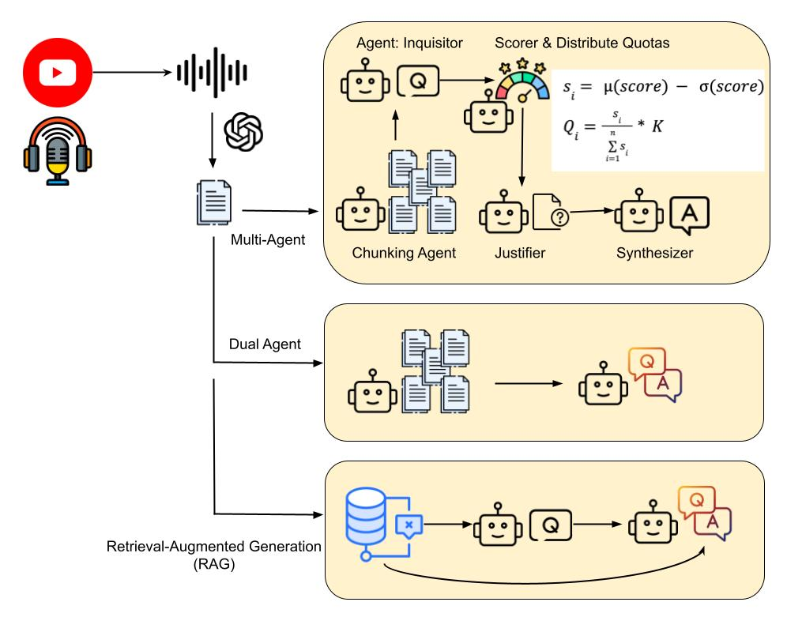

# Beyond Factual QA: Mentorship-Oriented Question Answering from Long-Form Multilingual Content

[](https://arxiv.org/abs/2601.17173) 
[](https://huggingface.co/datasets/AIM-SCU/MentorQA) 

This repository contains the dataset and code for our paper: 

**Beyond Factual QA: Mentorship-Oriented Question Answering from Long-Form Multilingual Content**.

📄 **Preprint:** [https://arxiv.org/pdf/2601.17173](https://arxiv.org/pdf/2601.17173)

<p align="center">
  
</p>

## 📖 Overview

We introduce **MentorQA**, the first multilingual benchmark for mentorship-focused question answering from long-form videos. Standard AI benchmarks often reward models for generating generic, surface-level factual answers. However, real-world users seeking advice need deep, actionable guidance. 

This project shows that our multi-agent QA systems produce significantly more effective guidance than factual QA baselines—especially for complex topics and low-resource languages—while highlighting the limits of current automated evaluation.

### Core Objectives & Real-World Impact
* **Time-Efficient Learning:** Access key mentorship knowledge without needing to watch hours of long-form video.
* **Enhanced Accessibility:** Support learners with attention deficits or limited focus spans by distilling complex topics into clear, bite-sized QAs.
* **Global Reach:** Democratize mentorship access across multiple languages, breaking down cultural and linguistic barriers.
* **Advanced AI Extraction:** Utilize multi-agent, multimodal AI to efficiently pinpoint and extract only the most valuable insights from a sea of content.

---

## 📊 Dataset

The MentorQA dataset contains the video links and generated QA pairs evaluated in our study. It can be accessed directly on HuggingFace:

🔗 **[https://huggingface.co/datasets/AIM-SCU/MentorQA](https://huggingface.co/datasets/AIM-SCU/MentorQA)**

---

## 📂 Repository Structure

```text
MentorQA/
├── Anonymized-Dataset/  # The anonymized human & LLM evaluation dataset
├── LLMChunking/         # Code for Dual-Agent chunking baseline methods
├── MultiAgentChunking/  # Core multi-agent chunking and extraction framework (Ours)
├── RAG/                 # Retrieval-Augmented Generation baseline implementation
├── SingleQA/            # Baseline Single-Agent QA pipeline scripts
├── common_utils/        # Shared utility functions (paths to models)
├── preprocess.py        # Main script for preprocessing video transcripts

└── run.py               # Main execution script for the generation pipelines
```


## ⚙️ Installation

### 1. Clone the repository:

```bash
git clone https://github.com/AIM-SCU/MentorQA.git
cd MentorQA
```

### 2. Create a virtual environment (Recommended):

```bash
python -m venv venv
source venv/bin/activate  # On Windows use: venv\Scripts\activate
```

### 3. Install Core Dependencies:
Our pipeline utilizes the following open-weights models. Ensure your environment has enough VRAM/RAM to support them: 
* [**Qwen2.5-7B-Instruct-1M**](https://huggingface.co/Qwen/Qwen2.5-7B-Instruct-1M): Used for robust, multilingual question synthesis and answer generation.
* [**BGE-M3**](https://huggingface.co/BAAI/bge-m3): Used for state-of-the-art multilingual text embeddings and retrieval.
* [**Whisper-large-v3**](https://huggingface.co/openai/whisper-large-v3):
You can install the required libraries directly using pip.

## 🚀 How to Run
The entire pipeline (preprocessing, audio extraction, transcription, and QA generation) is orchestrated by a single script: run.py.

### 1. Prepare your input CSV
Create a CSV file (e.g., videos.csv) containing the videos you want to process. It must contain index, url, and language columns:
Before running the models, preprocess your long-form video transcripts using the preprocessing script:

```bash
index,url,language
1,[https://youtube.com/watch?v=example1,English](https://youtube.com/watch?v=example1,English)
2,[https://youtube.com/watch?v=example2,Chinese](https://youtube.com/watch?v=example2,Chinese)
```

### 2. Run the Generation Pipeline
Run run.py and pass your CSV file. The script will automatically build a structured output folder (default: Master/), preprocess the videos, and run the selected approaches.

* Approach IDs: 1 (SingleAgent), 2 (DualAgent), 3 (MultiAgent/Ours), 4 (RAG).

```bash

```

📝 Citation
If you use our code, the MENTORQA dataset, or find our work helpful in your research, please cite our paper:

```bibtex
@article{bhalerao2026mentorqa,
  title={Beyond Factual QA: Mentorship-Oriented Question Answering over Long-Form Multilingual Content},
  author={Bhalerao, Parth and Dsouza, Diola and Guan, Ruiwen and Ignat, Oana},
  journal={arXiv preprint arXiv:2601.17173},
  year={2026}
}
```

## 📝 License

MIT License


